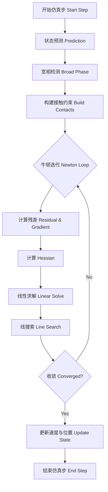

# 刚体接触仿真平台设计文档 (2/3) - 系统架构设计

## 1. 系统总体架构

系统采用分层架构设计，各层职责明确，便于扩展和维护。

### 1.1 架构分层
- **应用层 (Application)**: 场景管理、用户交互、仿真循环控制。
- **动力学层 (Dynamics)**: 刚体系统、约束求解器、时间积分器。
- **物理核心层 (Physics Core)**: IPC接触算法、SDF几何计算、空间加速结构。
- **基础数学层 (Math Foundation)**: 线性代数(Eigen)、非线性优化(Newton-Raphson)、稀疏矩阵求解。

---

## 2. 核心类设计 (C++ Interface)

### 2.1 基础几何与物体 (Geometry & Body)

```cpp
// 几何形状基类
class Shape {
public:
    virtual double sdf(const Eigen::Vector3d& p) const = 0;
    virtual Eigen::Vector3d gradient(const Eigen::Vector3d& p) const = 0;
    virtual AABB computeAABB() const = 0;
};

// 刚体类
class RigidBody {
public:
    // 状态量
    Eigen::Vector3d x;      // 位置
    Eigen::Quaterniond q;   // 姿态
    Eigen::Vector3d v;      // 线速度
    Eigen::Vector3d w;      // 角速度
    
    // 物理属性
    double mass;
    Eigen::Matrix3d inertia;
    std::shared_ptr<Shape> geometry;
    bool is_static;
    
    // 方法
    Eigen::Vector3d toWorld(const Eigen::Vector3d& p_local) const;
    Eigen::Vector3d toLocal(const Eigen::Vector3d& p_world) const;
    void updateInertiaWorld(); // 更新世界坐标系下的惯性张量
};
```

### 2.2 IPC 接触模型 (Contact Model)

```cpp
struct ContactConstraint {
    int body_id_a;
    int body_id_b;
    double weight;
    // ... 接触点信息
};

// 能量项基类 (Form-based Architecture)
class Form {
public:
    virtual double value(const Eigen::VectorXd& x) const = 0;
    virtual void gradient(const Eigen::VectorXd& x, Eigen::VectorXd& grad) const = 0;
    virtual void hessian(const Eigen::VectorXd& x, Eigen::SparseMatrix<double>& hess) const = 0;
    virtual double max_step(const Eigen::VectorXd& x, const Eigen::VectorXd& dx) const { return 1.0; }
};

class InertiaForm : public Form { ... }; // 惯性项
class BarrierForm : public Form { ... }; // IPC 接触势能
class FrictionForm : public Form { ... }; // 摩擦势能
class ConstraintForm : public Form { ... }; // 软约束势能

class IPCSystem {
    std::vector<std::shared_ptr<Form>> forms;
    // ... 
};
```

### 2.3 系统求解器 (Solver & Integrator)

```cpp
class ImplicitIntegrator {
public:
    virtual void step(World& world, double dt) = 0;
};

class NewtonEulerIntegrator : public ImplicitIntegrator {
public:
    void step(World& world, double dt) override {
        // 1. 预测
        // 2. 构建优化问题 (F(x) = M(x-x_pred) + h^2 * grad_E = 0)
        // 3. 牛顿迭代求解
        // 4. 更新状态
    }
    
private:
    IPCSystem ipc_system;
    ConstraintSolver constraint_solver;
};
```

---

## 3. 关键算法流程图

### 3.1 单步仿真流程



### 3.2 线性系统构建 (Linear System Assembly)

线性方程组 $\mathbf{A} \delta \mathbf{x} = \mathbf{b}$ 的构建：

1. **质量矩阵 $\mathbf{M}$**: 块对角矩阵，包含 $m\mathbf{I}$ 和 $\mathbf{I}_{world}$。
2. **势能 Hessian $\nabla^2 E$**: 
   - $E_{gravity}$: 0 (如果是恒定重力)
   - $E_{contact}$: 由 IPC 模块计算，稀疏矩阵。
   - $E_{joint}$: 由约束模块计算。
3. **系统矩阵 $\mathbf{A}$**:
   $$
   \mathbf{A} = \mathbf{M} + h^2 (\nabla^2 E_{contact} + \nabla^2 E_{joint})
   $$
   注意：$\mathbf{A}$ 是对称正定(SPD)的（在适当的线搜索和正定修正下），可以使用 LLT (Cholesky) 分解加速求解。

---

## 4. 数据流设计

1. **输入**: 
   - 场景描述文件 (JSON/XML): 定义刚体、SDF路径、初始状态、约束关系。
   - 仿真参数: `dt`, `kappa`, `dhat`, `friction_coeff`.

2. **运行时数据**:
   - 全局状态向量 $\mathbf{X} = [\mathbf{x}_1, \mathbf{q}_1, \dots, \mathbf{x}_n, \mathbf{q}_n]^T$。
   - 速度向量 $\mathbf{V} = [\mathbf{v}_1, \mathbf{\omega}_1, \dots]^T$。
   - 稀疏矩阵存储 (CSR/CSC 格式) 用于 Hessian。

3. **输出**:
   - 每一帧的刚体位姿序列 (用于渲染/回放)。
   - 能量曲线、接触力数据 (用于分析)。
