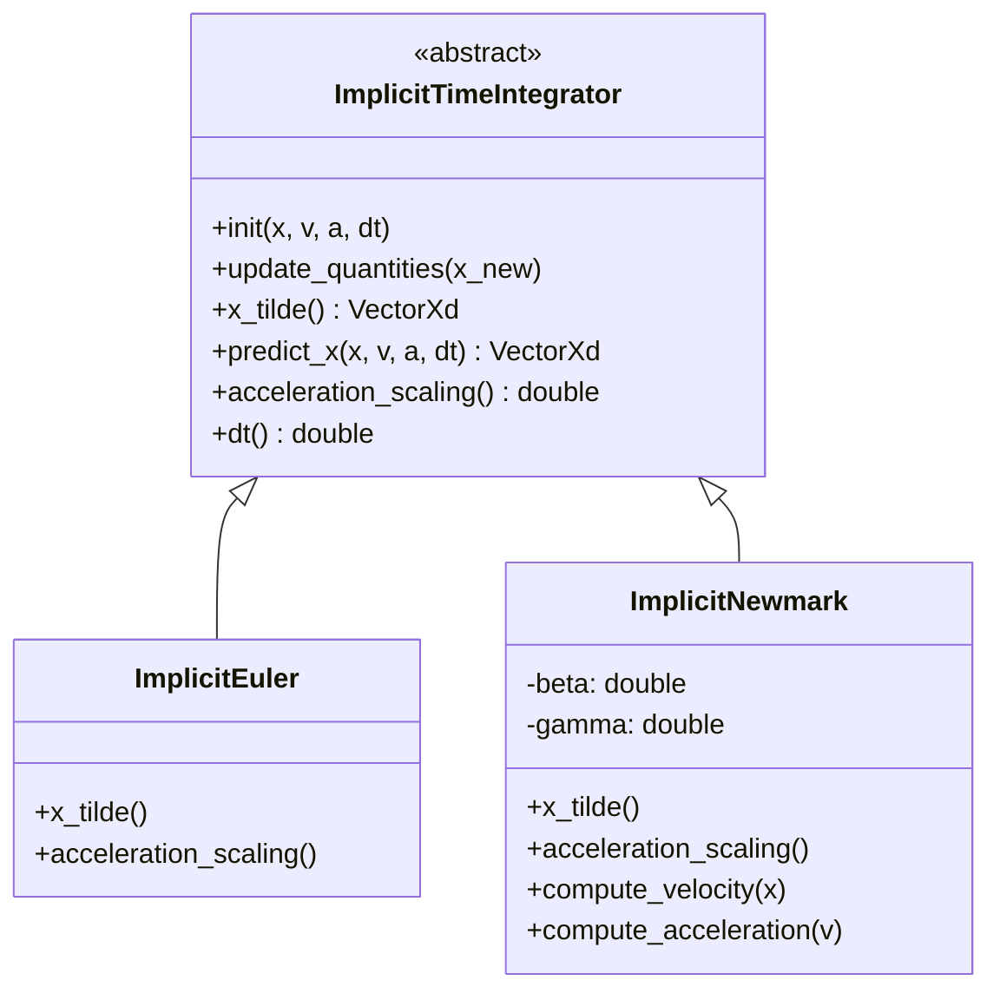

# 设计文档：Implicit Newmark 时间积分方案

## 1. 背景与目标

当前 NexDynIPC 使用一阶隐式欧拉（Implicit Euler）积分器，导致明显的数值阻尼和能量耗散。为提升仿真精度并向商用软件对齐，计划升级为 **Implicit Newmark-β** 方案。

设计参照 **PolyFEM** 的架构，采用面向对象的方式实现时间积分器的抽象和扩展。

## 2. 核心架构设计 (Ref: PolyFEM)

### 2.1 类图概览



### 2.2 核心公式 (Newmark-β)

Newmark 方法的更新公式：

$$
x_{n+1} = x_n + h v_n + \frac{h^2}{2} [ (1-2\beta) a_n + 2\beta a_{n+1} ]
$$
$$
v_{n+1} = v_n + h [ (1-\gamma) a_n + \gamma a_{n+1} ]
$$

在增量势能（IPC）框架中，我们需要将其转化为求解 $x_{n+1}$ 的无约束优化问题。为此，我们将 $v_{n+1}$ 和 $a_{n+1}$ 表示为 $x_{n+1}$ 的函数。

通过整理公式（参考 PolyFEM `ImplicitNewmark.hpp`）：

$$
a_{n+1} = \frac{1}{\beta h^2} (x_{n+1} - x_n - h v_n) - \frac{1-2\beta}{2\beta} a_n
$$

这就构成了优化目标中的惯性项（Inertia Term）：

$$
\min_{x_{n+1}} \frac{1}{2} (x_{n+1} - \tilde{x})^T M (x_{n+1} - \tilde{x}) + h^2 \beta \cdot V(x_{n+1})
$$

其中预测位置 $\tilde{x}$ 为：

$$
\tilde{x} = x_n + h v_n + h^2 (\frac{1}{2} - \beta) a_n
$$

**注意**：PolyFEM 的实现中，目标函数通常写成 $E = \frac{1}{2} (x - \tilde{x})^T M (x - \tilde{x}) + \dots$ 的形式。对于隐式欧拉，$\tilde{x} = x_n + h v_n$。对于 Newmark，$\tilde{x}$ 包含了加速度项。

### 2.3 `ImplicitTimeIntegrator` 接口定义

```cpp
class ImplicitTimeIntegrator {
public:
    virtual ~ImplicitTimeIntegrator() = default;

    // 初始化积分器状态（在仿真开始或重置时调用）
    virtual void init(const Eigen::VectorXd& x, const Eigen::VectorXd& v, const Eigen::VectorXd& a, double dt);

    // 计算预测位置 x_tilde (用于惯性项: 0.5 * (x - x_tilde)^T * M * (x - x_tilde))
    virtual Eigen::VectorXd x_tilde() const = 0;

    // 计算加速度缩放因子 (用于势能项: scaling * V(x))
    // 隐式欧拉: h^2
    // Newmark: beta * h^2
    virtual double acceleration_scaling() const = 0;

    // 更新内部状态 (在每步优化收敛后调用)
    virtual void update_quantities(const Eigen::VectorXd& x_new) = 0;

    // 获取当前时间步长
    double dt() const { return dt_; }

protected:
    double dt_;
    Eigen::VectorXd x_prev_, v_prev_, a_prev_;
};
```

### 2.4 `ImplicitNewmark` 实现细节

```cpp
class ImplicitNewmark : public ImplicitTimeIntegrator {
public:
    ImplicitNewmark(double beta = 0.25, double gamma = 0.5) 
        : beta_(beta), gamma_(gamma) {}

    Eigen::VectorXd x_tilde() const override {
        // x_tilde = x_n + h * v_n + h^2 * (0.5 - beta) * a_n
        return x_prev_ + dt_ * v_prev_ + dt_ * dt_ * (0.5 - beta_) * a_prev_;
    }

    double acceleration_scaling() const override {
        return beta_ * dt_ * dt_;
    }

    void update_quantities(const Eigen::VectorXd& x_new) override {
        // 1. 计算新加速度 a_{n+1}
        // a_{n+1} = (x_{n+1} - x_tilde) / (beta * h^2) ??? 
        // 不，直接用公式: a_{n+1} = (x_{n+1} - x_n - h*v_n - h^2*(0.5-beta)*a_n) / (beta * h^2)
        Eigen::VectorXd a_new = (x_new - x_prev_ - dt_ * v_prev_ - dt_ * dt_ * (0.5 - beta_) * a_prev_) / (beta_ * dt_ * dt_);

        // 2. 计算新速度 v_{n+1}
        Eigen::VectorXd v_new = v_prev_ + dt_ * ((1.0 - gamma_) * a_prev_ + gamma_ * a_new);

        // 3. 更新状态
        x_prev_ = x_new;
        v_prev_ = v_new;
        a_prev_ = a_new;
    }

private:
    double beta_;
    double gamma_;
};
```

**关于参数**：
- **平均加速度法 (Average Acceleration)**: $\beta=0.25, \gamma=0.5$。这是无条件稳定、二阶精度、无数值阻尼的方案。**这就是我们要对齐的“隐式中点法”变种。**
- **线性加速度法 (Linear Acceleration)**: $\beta=1/6, \gamma=0.5$。条件稳定。
- **Fox-Goodwin**: $\beta=1/12, \gamma=0.5$。四阶精度（对于无阻尼线性系统），条件稳定。

我们将默认使用 $\beta=0.25, \gamma=0.5$。

## 3. 对现有系统的修改计划

### 3.1 修改 `ExplicitEuler` / 重构为 `Simulation`

目前 `ImplicitEuler` 类其实承担了 `Solver` 的角色（包含 `NewtonSolver` 和 `Forms`）。我们需要将积分器逻辑剥离出来。

**新架构：**
1. **`Solver` 类** (或保留 `ImplicitEuler` 但改名为 `NewtonIntegratorSolver`?): 负责 Newton 迭代、组装 Hessian/Gradient。
2. **`TimeIntegrator` 成员**: `Solver` 持有一个 `TimeIntegrator` 指针。
3. **能量计算修改**:
   - 惯性项：使用 `integrator->x_tilde()`
   - 势能项：系数乘上 `integrator->acceleration_scaling()` 而不是固定的 `dt*dt`

**逐步实施步骤：**

1. **Step 1: 创建文件**
   - `include/NexDynIPC/TimeIntegration/ImplicitTimeIntegrator.hpp`
   - `include/NexDynIPC/TimeIntegration/ImplicitNewmark.hpp`
   - 以及对应的 `.cpp`。

2. **Step 2: 修改 `simulation_config`**
   - 添加 `integration_scheme` 选项 (Enum: Euler, Newmark)。

3. **Step 3: 重构 `ImplicitEuler` 类**
   - **重命名**：当前的 `ImplicitEuler` 类实际上是一个“基于IPC的时间步进器”。重命名为 `IPCSolver`。
   - **引入 `std::shared_ptr<TimeIntegrator> integrator_`**。
   - **修改 `computeValue` / `gradient` / `hessian`**:
     - 将硬编码的惯性预测项 $x_n + h v_n$ 替换为 `integrator_->x_tilde()`。
     - 将硬编码的 $dt^2$ 替换为 `integrator_->acceleration_scaling()`。

4. **Step 4: 验证**
   - 运行双摆测试，对比 `Newmark(\beta=0.25, \gamma=0.5)` 与 `Euler` 的结果。

## 4. 预期风险与对策

- **风险 1**: 现有代码深度依赖 `dt*dt`。
  - **对策**: 使用 IDE 搜索所有 `dt` 的使用点，确保全部替换为积分器接口调用。
- **风险 2**: 初始加速度 $a_0$ 的计算。
  - **调研结论**: PolyFEM 的 `initial_acceleration` 最终调用 Problem 的接口，默认初始化为 0。只有在特定问题中才会计算。
  - **理论参考**: 用户提供的 `Theory_of_Initial_Condition_Analysis_for_Multibody_Systems.md` (第5章) 详细描述了计算一致初始加速度 $a_0$ 的严谨方法（求解 KKT 系统）：
    $$
    \begin{bmatrix} M & C_q^T \\ C_q & 0 \end{bmatrix} \begin{bmatrix} \ddot{q} \\ \lambda \end{bmatrix} = \begin{bmatrix} Q \\ \gamma \end{bmatrix}
    $$
  - **设计决策**: 虽然理论完备，但鉴于当前框架基于 ALM/IPC（无显式 $C_q$），直接实现该 KKT 求解器成本较高。结合 PolyFEM 的实践，我们在 **Phase 1** 仍采用 $a_0=0$ 的工程简化策略。后续可根据该理论文档实现专门的 `InitialAccelerationSolver`。
- **风险 3**: PolyFEM 代码中的参数读取 Bug。
  - **发现**: PolyFEM `ImplicitNewmark.cpp` 中读取 JSON 时 `beta` 和 `gamma` 的键值似乎互换了。
  - **对策**: 我们不完全照抄其 JSON 解析代码，而是按照标准的 Newmark 参数定义（$\beta$ 对应 displacement，$\gamma$ 对应 velocity）来实现，默认值设为标准隐式中点法配置 ($\beta=0.25, \gamma=0.5$)。

## 5. 参考资料

- [PolyFEM ImplicitTimeIntegrator](file:///e:/workspace/NexDynIPC/temps/polyfem-main/polyfem-main/src/polyfem/time_integrator/ImplicitTimeIntegrator.cpp)
- [PolyFEM ImplicitNewmark](file:///e:/workspace/NexDynIPC/temps/polyfem-main/polyfem-main/src/polyfem/time_integrator/ImplicitNewmark.cpp)
