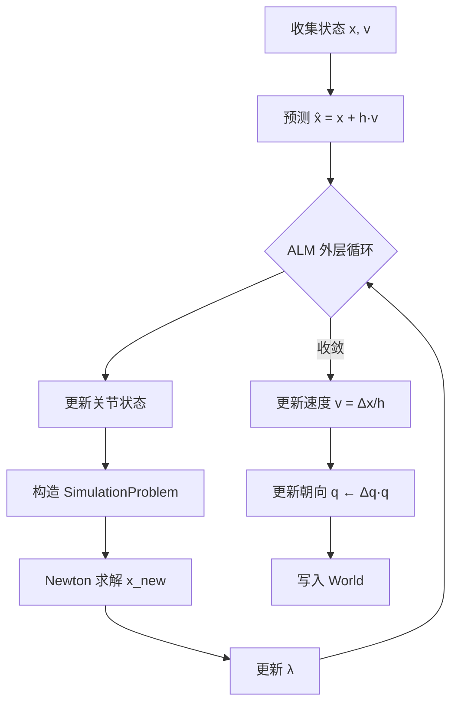

# 双摆模型建模总结

## 1. 场景设置

双摆由一个静态锚点和两根动态连杆组成，通过铰链关节依次连接。

```
        Anchor (static)
        (0, 0, 0)
           |
    Joint1 ● Z-axis hinge
           |
  Link1 ──●── (COM: 0.5, 0, 0), length=1
           |
    Joint2 ● Z-axis hinge
           |
  Link2 ──●── (COM: 1.5, 0, 0), length=1
```

### 刚体参数

| 刚体    | 位置 (初始)    | 质量  | 惯性张量       | 静态? |
|---------|-------------|------|--------------|------|
| Anchor  | (0, 0, 0)   | —    | —            | ✓    |
| Link1   | (0.5, 0, 0) | 1 kg | $I = I_{3×3}$ | ✗    |
| Link2   | (1.5, 0, 0) | 1 kg | $I = I_{3×3}$ | ✗    |

### 关节定义

| 关节   | 连接          | 锚点A (局部)  | 锚点B (局部)   | 旋转轴 |
|--------|-------------|-------------|--------------|-------|
| Joint1 | Anchor↔Link1 | (0, 0, 0)  | (-0.5, 0, 0) | Z     |
| Joint2 | Link1↔Link2  | (0.5, 0, 0) | (-0.5, 0, 0) | Z    |

> [!NOTE]
> 锚点在各自刚体的**局部坐标系**中给出。连接点在世界坐标系中分别为 (0,0,0) 和 (1,0,0)。

---

## 2. 数学建模

### 2.1 隐式欧拉时间积分

每个时间步求解如下优化问题：

$$\min_x \; \underbrace{\frac{1}{2} (x - \hat{x})^T M (x - \hat{x})}_{\text{惯性项}} + \underbrace{h^2 \Psi_{\text{gravity}}(x)}_{\text{重力势能}} + \underbrace{E_{\text{ALM}}(x)}_{\text{约束能量 (不乘 $h^2$)}}$$

其中：
- $x = [p_1, \theta_1, p_2, \theta_2]^T \in \mathbb{R}^{12}$（仅动态刚体）
- $\hat{x} = x_n + h \cdot v_n$（预测位置）
- $h = 0.01\text{s}$（时间步长）
- $M = \text{diag}(m_1 I_3, I_1, m_2 I_3, I_2)$（质量矩阵）

### 2.2 状态表示

采用**混合表示**：
- **位置**：绝对世界坐标 $p \in \mathbb{R}^3$
- **旋转**：增量旋转向量 $\theta \in \mathbb{R}^3$（每步相对于当前朝向的增量）

每步结束后，增量旋转通过轴角公式更新至四元数：

$$q_{n+1} = \Delta q(\theta) \cdot q_n, \quad \Delta q = \text{AxisAngle}(\hat{\theta}, \|\theta\|)$$

---

## 3. 铰链关节约束 (ALM)

### 3.1 约束方程

每个铰链关节施加 6 个约束（$C \in \mathbb{R}^6$）：

**位置约束** $C_{\text{pos}} \in \mathbb{R}^3$（锚点重合）：
$$C_{\text{pos}} = (p_A + R_A r_A) - (p_B + R_B r_B) = 0$$

**轴对齐约束** $C_{\text{align}} \in \mathbb{R}^3$（旋转轴平行）：
$$C_{\text{align}} = (R_A n_A) \times (R_B n_B) = 0$$

### 3.2 增广拉格朗日法 (ALM)

约束能量：
$$E_{\text{ALM}} = \lambda^T C(x) + \frac{\mu}{2} \|C(x)\|^2$$

- $\lambda \in \mathbb{R}^6$：拉格朗日乘子（约束力的近似）
- $\mu = 1000$：罚参数（数值弹簧刚度）

#### ALM 外层循环

```
for alm_iter = 1 to 10:
    1. 更新关节状态 (索引映射 + 参考朝向)
    2. 构造 SimulationProblem
    3. Newton 内迭代求解 x_new
    4. 更新乘子: λ ← λ + μ · C(x_new)
```

### 3.3 静态刚体处理

当关节连接静态刚体时（如 Anchor）：
- 全局索引设为 -1
- 在 `computeC` 和 `computeJ` 中，静态刚体的位置和朝向取固定值，不从优化变量 $x$ 中读取
- 雅可比矩阵中不填入静态刚体对应的列

### 3.4 关键设计决策：ALM 能量不乘 $h^2$

> [!IMPORTANT]
> ALM 约束能量**不乘以** $h^2$，这与重力势能的处理不同。
>
> 原因：ALM 不是物理势能，而是**约束执行机制**。若乘以 $h^2 = 10^{-4}$，有效刚度仅为 $\mu \cdot h^2 = 0.1$，远弱于惯性项（$m = 1$），导致约束无法被有效执行，仿真发散。

---

## 4. 求解器流水线



### 涉及文件

| 文件 | 职责 |
|------|------|
| [ImplicitEuler.cpp](file:///e:/workspace/NexDynIPC/src/Dynamics/ImplicitEuler.cpp) | ALM 循环、状态更新、索引映射 |
| [Joint.hpp](file:///e:/workspace/NexDynIPC/include/NexDynIPC/Dynamics/Joints/Joint.hpp) / [.cpp](file:///e:/workspace/NexDynIPC/src/Dynamics/Joints/Joint.cpp) | 基类：ALM value/gradient/hessian |
| [HingeJoint.hpp](file:///e:/workspace/NexDynIPC/include/NexDynIPC/Dynamics/Joints/HingeJoint.hpp) / [.cpp](file:///e:/workspace/NexDynIPC/src/Dynamics/Joints/HingeJoint.cpp) | 铰链约束 C, J 实现 |
| [ConstraintForm.cpp](file:///e:/workspace/NexDynIPC/src/Dynamics/Forms/ConstraintForm.cpp) | 聚合所有关节 |
| [InertiaForm.cpp](file:///e:/workspace/NexDynIPC/src/Dynamics/Forms/InertiaForm.cpp) | 惯性能量 |
| [GravityForm.cpp](file:///e:/workspace/NexDynIPC/src/Dynamics/Forms/GravityForm.cpp) | 重力势能 |
| [SceneLoader.cpp](file:///e:/workspace/NexDynIPC/src/App/SceneLoader.cpp) | 双摆场景定义 |

---

## 5. 仿真结果

### 参数

- 时间步长：$h = 0.01\text{s}$
- 总时间：$T = 3.0\text{s}$（301 帧）
- ALM 迭代次数：10 次/步
- Newton 最大迭代：20 次
- 罚参数：$\mu = 1000$

### 初始帧加速度

| 刚体  | $a_y$ (m/s²) | 说明                   |
|-------|-------------|------------------------|
| Anchor | 0           | 静态，不参与优化         |
| Link1  | -3.11       | 约束反力抵消部分重力     |
| Link2  | -6.94       | 约束较弱，更接近自由落体  |

> [!NOTE]
> 初始加速度 ≠ $-9.81$ 是正确的物理结果。即使初速度为零，重力仍在作用，约束力必须同时产生以防止关节分离。约束力的大小由优化器自动确定。

### 末帧状态 (t=3s)

| 刚体  | 位置              | 速度            | 加速度          |
|-------|------------------|----------------|----------------|
| Link1 | (0.40, -0.30, 0) | (-0.14, -0.19) | (-2.3, -3.0)   |
| Link2 | (0.94, -1.08, 0) | (-2.18, -0.96) | (-6.4, 1.8)    |

所有数值保持有界，仿真稳定运行。

---

## 6. 已知限制与后续改进

1. **惯性张量简化**：当前使用 $I = I_{3×3}$（单位矩阵），而非物理正确的细杆惯性 $I_{zz} = mL^2/12$。这会导致旋转动力学偏慢。
2. **2D 约束冗余**：双摆在 XY 平面运动，Z 轴旋转的对齐约束 $C_{\text{align}}$ 中有冗余分量（Z 分量始终为 0），但不影响正确性。
3. **ALM 收敛性**：固定 10 次 ALM 迭代，未做自适应收敛检查。
4. **$\mu$ 自适应**：罚参数 $\mu$ 固定为 1000，未实现自适应增长策略。
