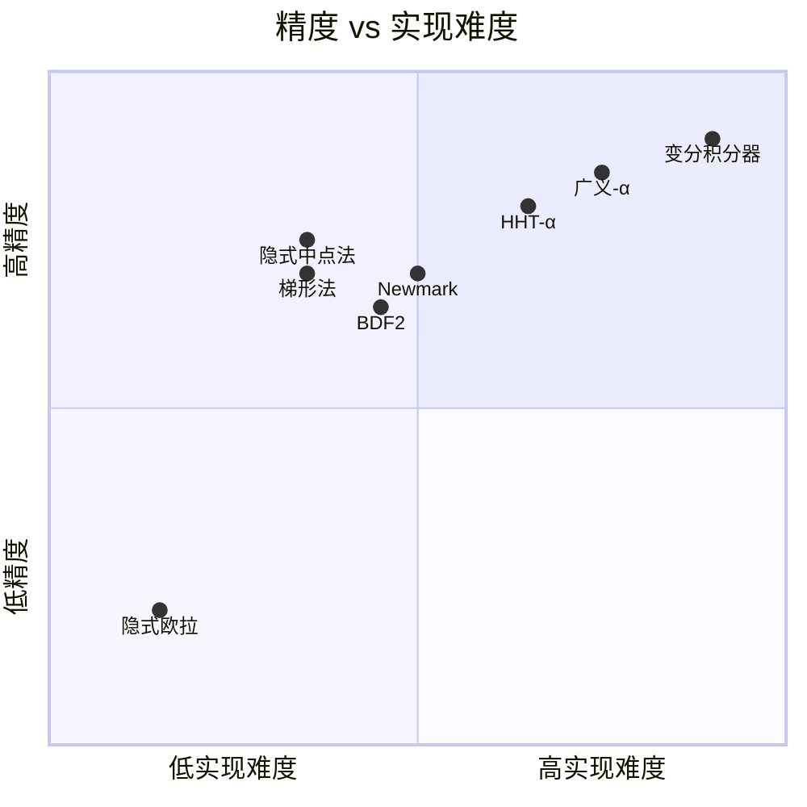

# 时间积分方案对比分析

## 1. 背景

当前 NexDynIPC 采用**隐式欧拉法（Backward Euler）**，属于一阶方法。与商用软件的对比表明：

- **一阶截断误差** $O(h)$ 在长时间积分中累积
- **数值阻尼过强**：隐式欧拉对所有频率模式都施加人为能量耗散
- 双摆等保守系统中，能量耗散导致轨迹偏离真解

升级到二阶（或更高阶）方案可以显著改善精度和能量守恒性。

---

## 2. 方案总览

| 方案 | 精度阶 | 稳定性 | 能量守恒 | 数值阻尼 | 实现难度 |
|------|--------|--------|---------|---------|---------|
| 隐式欧拉 (BE) | 1阶 | A-稳定 | ❌ 耗散 | 强 | ⭐ |
| 隐式中点法 | 2阶 | A-稳定 | ✅ 保辛 | 无 | ⭐⭐ |
| 梯形法 | 2阶 | A-稳定 | ✅ 无耗散 | 无 | ⭐⭐ |
| BDF2 | 2阶 | A-稳定 | ❌ 轻微耗散 | 弱 | ⭐⭐ |
| Newmark-β | 可调(1~2阶) | 条件/无条件 | 可调 | 可调 | ⭐⭐ |
| HHT-α | 2阶 | A-稳定 | ❌ 可控耗散 | 可控（高频） | ⭐⭐⭐ |
| 广义-α | 2阶 | A-稳定 | ❌ 可控耗散 | 最优可控 | ⭐⭐⭐ |
| 变分积分器 | 2阶 | — | ✅ 保辛 | 无 | ⭐⭐⭐⭐ |

---

## 3. 各方案详细分析

### 3.1 隐式欧拉法（Backward Euler）— 当前方案

**公式：**

$$
q_{n+1} = q_n + h \dot{q}_{n+1}
$$
$$
M \dot{q}_{n+1} = M \dot{q}_n + h f(q_{n+1})
$$

**优点：**
- 实现最简单，代码结构清晰
- 无条件 A-稳定，不会因刚性问题爆炸
- 天然适合 IPC 等优化框架（增量势能最小化）

**缺点：**
- 一阶精度，截断误差 $O(h)$
- 数值阻尼极强，严重耗散系统能量
- 长时间仿真中轨迹偏离真解

**适用场景：** 碰撞密集、以稳定性为首要目标的场景（如 IPC）

---

### 3.2 隐式中点法（Implicit Midpoint Rule）

**公式：**

$$
q_{n+1} = q_n + h \dot{q}_{n+1/2}
$$
$$
M \dot{q}_{n+1} = M \dot{q}_n + h f\!\left(\frac{q_n + q_{n+1}}{2}\right)
$$

其中 $\dot{q}_{n+1/2} = \frac{\dot{q}_n + \dot{q}_{n+1}}{2}$。

**优点：**
- **二阶精度**，截断误差 $O(h^2)$
- **保辛（Symplectic）**：长时间积分中能量振荡但不漂移
- A-稳定，无条件稳定
- 无数值阻尼
- 与现有 IPC 优化框架兼容性好，修改量小

**缺点：**
- 对高频噪声不进行衰减，可能引入高频振荡
- 碰撞/接触问题中不可微性可能导致迭代困难
- Newton 求解器收敛速度可能比隐式欧拉略慢

**适用场景：** 保守系统（无碰撞）、需要长时间能量守恒的场景

> [!TIP]
> **推荐作为首选升级方案**。与现有代码结构最兼容，只需将力的计算点从 $q_{n+1}$ 改为 $(q_n + q_{n+1})/2$。

---

### 3.3 梯形法（Trapezoidal Rule / Crank-Nicolson）

**公式：**

$$
q_{n+1} = q_n + \frac{h}{2}(\dot{q}_n + \dot{q}_{n+1})
$$
$$
M \dot{q}_{n+1} = M \dot{q}_n + \frac{h}{2}\big[f(q_n) + f(q_{n+1})\big]
$$

**优点：**
- 二阶精度
- A-稳定
- 无数值阻尼（能量精确守恒）
- 概念直观

**缺点：**
- 与隐式中点法在线性问题中等价，但非线性问题中可能有差异
- 高频模式无衰减，刚性问题中可能出现振荡
- 需要同时计算 $f(q_n)$ 和 $f(q_{n+1})$，每步额外计算量

**适用场景：** 热传导、结构动力学等非刚性问题

---

### 3.4 BDF2（二阶向后差分公式）

**公式：**

$$
q_{n+1} = \frac{4}{3} q_n - \frac{1}{3} q_{n-1} + \frac{2}{3} h \dot{q}_{n+1}
$$
$$
M \dot{q}_{n+1} = M \left(\frac{4}{3}\dot{q}_n - \frac{1}{3}\dot{q}_{n-1}\right) + \frac{2}{3} h f(q_{n+1})
$$

**优点：**
- 二阶精度
- A-稳定（L-稳定），对刚性问题表现优异
- 有轻微数值阻尼，可选择性衰减高频噪声
- 适合刚性 ODE/DAE 系统

**缺点：**
- **多步法**：需要存储两个历史时刻的状态 $(q_{n-1}, q_n)$
- 第一步需要用其他方法启动（通常用隐式欧拉或隐式中点法）
- 不保辛，长时间积分会有缓慢的能量漂移
- 在变步长情况下需要额外处理

**适用场景：** 刚性系统、DAE（微分代数方程）系统

---

### 3.5 Newmark-β 法

**公式：**

$$
q_{n+1} = q_n + h \dot{q}_n + \frac{h^2}{2}\big[(1-2\beta)\,\ddot{q}_n + 2\beta\,\ddot{q}_{n+1}\big]
$$
$$
\dot{q}_{n+1} = \dot{q}_n + h\big[(1-\gamma)\,\ddot{q}_n + \gamma\,\ddot{q}_{n+1}\big]
$$

其中 $\beta$ 和 $\gamma$ 是参数。

**常用参数组合：**

| 参数 | $\beta$ | $\gamma$ | 精度 | 稳定性 | 特性 |
|------|---------|----------|------|--------|------|
| 显式中心差分 | 0 | 1/2 | 2阶 | 条件稳定 | 无阻尼 |
| Fox-Goodwin | 1/12 | 1/2 | 2阶 | 条件稳定 | 精度最高 |
| 线性加速度 | 1/6 | 1/2 | 2阶 | 条件稳定 | 无阻尼 |
| 平均加速度 | 1/4 | 1/2 | 2阶 | 无条件稳定 | 无阻尼 ✓ |
| 数值阻尼 | 1/4 | >1/2 | 1阶 | 无条件稳定 | 有阻尼 |

**优点：**
- 结构动力学的工业标准方法
- 参数可调，灵活性高
- $\beta=1/4, \gamma=1/2$ 时是二阶、无数值阻尼、无条件稳定
- 概念清晰，文献丰富

**缺点：**
- 引入数值阻尼时（$\gamma > 1/2$），精度降为一阶
- 无法独立控制低频精度和高频阻尼
- 不保辛
- 需要直接操作加速度 $\ddot{q}$，与现有纯位移优化框架需要适配

**适用场景：** 结构动力学、有限元分析

---

### 3.6 HHT-α 法（Hilber-Hughes-Taylor）

**公式：**

$$
M \ddot{q}_{n+1} = (1+\alpha) f(q_{n+1}, \dot{q}_{n+1}) - \alpha f(q_n, \dot{q}_n)
$$

配合 Newmark 时间离散（$\beta, \gamma$ 与 $\alpha$ 关联）。参数范围 $\alpha \in [-1/3, 0]$。

**优点：**
- 二阶精度
- 无条件稳定
- **可控数值阻尼**：$\alpha$ 参数控制高频模式的衰减程度
- $\alpha=0$ 退化为 Newmark 平均加速度法
- 低频模式精度保持良好，仅衰减高频噪声
- 工程软件广泛使用（ABAQUS、ANSYS 等）

**缺点：**
- 参数选择需要经验
- 不保辛
- 实现比 Newmark 略复杂
- 与位移优化框架的兼容性需要额外工作

**适用场景：** 结构动力学、需要抑制高频噪声的问题

---

### 3.7 广义-α 法（Generalized-α Method）

**公式：**

$$
M \ddot{q}_{n+1-\alpha_m} = f(q_{n+1-\alpha_f}, \dot{q}_{n+1-\alpha_f})
$$

其中：
$$
q_{n+1-\alpha_f} = (1-\alpha_f) q_{n+1} + \alpha_f q_n
$$
$$
\ddot{q}_{n+1-\alpha_m} = (1-\alpha_m) \ddot{q}_{n+1} + \alpha_m \ddot{q}_n
$$

参数由谱半径 $\rho_\infty \in [0, 1]$ 唯一确定。

**优点：**
- 二阶精度
- 无条件稳定
- **最优数值阻尼控制**：通过单参数 $\rho_\infty$ 控制
  - $\rho_\infty = 1$：无阻尼（等价于梯形法）
  - $\rho_\infty = 0$：最大阻尼（高频模式被完全抑制）
- 在所有同阶方法中，低频精度最优
- 统一框架：HHT-α、Newmark 等为其特例

**缺点：**
- 实现复杂度较高
- 参数选择需要理解谱分析
- 不保辛
- 多体系统中需要额外处理旋转自由度

**适用场景：** 商用多体动力学软件、需要精确控制阻尼的场景

> [!NOTE]
> 许多商用多体动力学软件（如 MSC.Adams、RecurDyn）使用广义-α 法作为默认积分器。

---

### 3.8 变分积分器（Variational Integrator）

**原理：** 直接离散 Hamilton 原理（作用量积分），而非离散运动方程。

$$
\delta \sum_{k=0}^{N-1} L_d(q_k, q_{k+1}) = 0
$$

其中 $L_d$ 是拉格朗日量 $L(q, \dot{q})$ 的离散近似。

**优点：**
- **严格保辛**：从离散变分原理导出，天然保持辛结构
- **动量守恒**：自动满足 Noether 定理的离散版本
- 长时间能量行为极佳（有界振荡，无漂移）
- 数学性质优美，理论保证强

**缺点：**
- 实现难度大，需要重新推导离散拉格朗日量
- 处理约束（关节等）需要专门的变分约束离散方法
- 碰撞/接触处理复杂
- 与现有优化框架的兼容性差，可能需要大幅重构
- 文献相对学术导向，工程实践经验有限

**适用场景：** 天体力学、分子动力学、需要长时间保辛的学术研究

---

## 4. 综合对比

### 4.1 精度与稳定性



### 4.2 能量行为对比

| 方案 | 短期能量误差 | 长期能量行为 | 高频噪声处理 |
|------|------------|-------------|-------------|
| 隐式欧拉 | 大（$O(h)$） | 持续耗散 ↓↓ | 强衰减 |
| 隐式中点法 | 小（$O(h^2)$） | 有界振荡 ↔ | 不衰减 |
| 梯形法 | 小（$O(h^2)$） | 有界振荡 ↔ | 不衰减 |
| BDF2 | 小（$O(h^2)$） | 缓慢耗散 ↓ | 轻微衰减 |
| Newmark(β=¼) | 小（$O(h^2)$） | 有界振荡 ↔ | 不衰减 |
| HHT-α | 小（$O(h^2)$） | 可控耗散 ↓ | 可控衰减 |
| 广义-α | 小（$O(h^2)$） | 可控耗散 ↓ | 最优可控衰减 |
| 变分积分器 | 小（$O(h^2)$） | 严格有界 ↔ | 不衰减 |

---

## 5. 针对 NexDynIPC 的推荐

### 5.1 首选方案：隐式中点法

**理由：**

1. **与现有代码结构最兼容**：当前代码采用增量势能最小化框架，隐式中点法只需要将能量和力的计算点从 $x_{n+1}$ 改为 $\frac{x_n + x_{n+1}}{2}$
2. **保辛性**：双摆是保守系统，保辛保证长时间能量不漂移
3. **修改量最小**：主要修改 `ImplicitEuler.cpp` 中的 `computeValue`、`gradient`、`hessian` 函数中的状态评估点

**具体修改思路：**

```diff
 // computeValue
-val += gravity_form_->value(x);          // 在 x_{n+1} 处计算
+val += gravity_form_->value(x_mid);       // 在 (x_n + x_{n+1})/2 处计算

 // gradient  
-gravity_form_->gradient(x, grad);
+gravity_form_->gradient(x_mid, grad_mid);
+grad += 0.5 * grad_mid;                   // 链式法则: d/dx = 0.5 * d/dx_mid
```

### 5.2 备选方案：BDF2

**适合场景：** 如果后续引入碰撞/接触且高频振荡成为问题。

**注意事项：**
- 需要第一步用隐式欧拉启动
- 需要存储额外的历史状态

### 5.3 长期目标：广义-α 法

**适合场景：** 如果目标是与商用软件精度完全对齐。

**注意事项：**
- 实现复杂度高
- 需要同时操作位置、速度和加速度
- 旋转自由度需要特殊处理（李群广义-α）

---

## 6. 参考文献

1. Hairer, E., Lubich, C., & Wanner, G. (2006). *Geometric Numerical Integration*. Springer.
2. Newmark, N. M. (1959). A Method of Computation for Structural Dynamics. *ASCE J. Eng. Mech.*
3. Hilber, H., Hughes, T., & Taylor, R. (1977). Improved Numerical Dissipation for Time Integration Algorithms in Structural Dynamics. *Earthquake Eng. Struct. Dyn.*
4. Chung, J., & Hulbert, G. (1993). A Time Integration Algorithm for Structural Dynamics with Improved Numerical Dissipation: The Generalized-α Method. *J. Appl. Mech.*
5. Marsden, J. E., & West, M. (2001). Discrete Mechanics and Variational Integrators. *Acta Numerica.*
6. Li, M., Ferguson, Z., et al. (2020). Incremental Potential Contact. *ACM Trans. Graph. (SIGGRAPH).*
